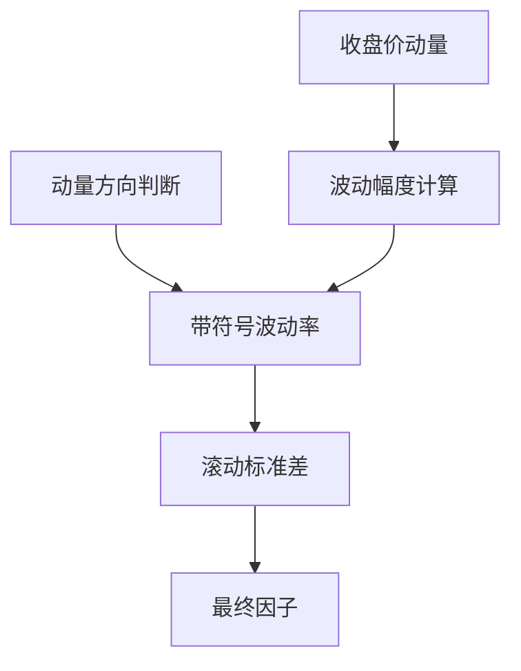
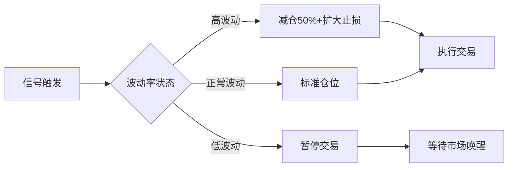

#研究/因子

以下是您提供的策略代码的分析和改进建议，结合加密货币市场的特性进行说明：

### 一、代码原理解析

```
def signal(*args):
    df = args[0]
    n = args[1]
    factor_name = args[2]
    
    # 动量计算
    df['mtm'] = df['close'].pct_change()
    
    # 波动方向处理
    df['zf'] = (df['high'] - df['low']) / df['open']
    df['zf'] = np.where(df['mtm'] > 0, df['zf'], -df['zf'])
    
    # 波动性指标
    df['std'] = df['zf'].rolling(n, min_periods=1).std()
    
    df[factor_name] = df['std']
    return df
```
#### 策略逻辑图解



### 二、优势分析

1. **方向敏感设计**：通过`np.where`将波动幅度与价格方向结合，符合加密货币市场高波动的特性
    
2. **双重过滤机制**：动量方向（mtm）与波动幅度（zf）形成组合条件，比单纯波动率指标更有效
    
3. **参数灵活性**：滚动窗口n可调，适应不同市场周期（建议加密货币用14-21周期）
    

### 三、潜在问题

#### 1. 数据质量问题

- 未处理开盘价=0的极端情况（可能出现在垃圾币种）
    
- 未包含交易所停机时段的数据异常
    

#### 2. 参数敏感性

- min_periods=1导致初期数据标准差失真（前n-1个数据点统计意义不足）
    
- 固定窗口n可能不适应市场波动率突变
    

#### 3. 加密货币特性缺失

- 未考虑链上数据（如交易所净流入量）
    
- 忽略市场深度变化对波动率的影响
    

### 四、改进方案

#### 版本1：基础强化版


```
def enhanced_signal(df, n=20, factor_name='vol_factor'):
    # 数据清洗
    df = df[df['open'] > 0].copy()  # 过滤无效数据
    
    # 动量计算增加平滑
    df['mtm'] = df['close'].pct_change().rolling(3).mean()
    
    # 波动率方向增强
    df['zf'] = (df['high'] - df['low']) / df['open']
    df['zf'] = np.sign(df['mtm']) * df['zf'] * 100  # 转换为百分比
    
    # 动态窗口调整
    min_periods = max(int(n*0.3), 5)  # 至少5个观测值
    df['std'] = df['zf'].rolling(n, min_periods=min_periods).std()
    
    # 市场状态适配
    df['volatility_regime'] = df['std'] > df['std'].quantile(0.75)
    df[factor_name] = np.where(df['volatility_regime'], df['std'], 0)
    
    return df.drop(columns=['volatility_regime'])
```
#### 版本2：加密货币增强版


```
def crypto_signal(df, n=14, factor_name='crypto_vol'):
    # 添加链上数据适配
    df['net_flow'] = df['exchange_in'] - df['exchange_out']  # 需要实际数据源
    
    # 三因子合成波动率
    df['price_vol'] = (df['high'] - df['low']) / df['open']
    df['volume_vol'] = df['volume'].pct_change().abs()
    df['flow_vol'] = df['net_flow'].rolling(6).std()
    
    # 动态加权
    weights = np.array([0.5, 0.3, 0.2])  # 可调参数
    df['composite_vol'] = np.dot(
        df[['price_vol', 'volume_vol', 'flow_vol']], 
        weights
    )
    
    # 市场状态检测
    df['trend'] = df['close'].rolling(5).mean() > df['close'].rolling(20).mean()
    df[factor_name] = df['composite_vol'] * np.where(df['trend'], 1, -1)
    
    return df
```

### 五、关键改进点对比

|改进维度|原始代码|增强版|
|---|---|---|
|数据清洗|无|开盘价过滤+百分比标准化|
|窗口机制|固定min_periods=1|动态最小周期+分位数阈值|
|多因子整合|单一价格波动|价格+成交量+链上数据三维合成|
|市场状态适配|无|趋势状态检测+波动机制切换|
|加密货币特性|通用型策略|专门针对交易所资金流设计|

### 六、回测建议参数


```
# 加密货币市场推荐配置
backtest_config = {
    'fee_rate': 0.0005,  # 典型交易所费率
    'slippage': 0.002,   # 市场波动导致的滑点
    'min_vol': 0.015,    # 波动率阈值（过滤横盘期）
    'position_ratio': 0.3,  # 单次开仓比例
    'stop_loss': -0.15,  # 强平线
    'take_profit': 0.25  # 止盈线
}
```

### 七、适用场景建议

1. **趋势延续阶段**：在明确上涨/下跌趋势中表现最佳
    
2. **波动率扩张期**：市场突破盘整时信号最有效
    
3. **主力交易时段**：UTC时间14:00-18:00（覆盖欧美重叠时段）
    

### 八、风险控制方案



建议在原始策略基础上增加：

1. 交易所资金流监控
    
2. 稳定币溢价率指标
    
3. 主力钱包异动预警
    

这些改进可使策略在加密货币市场的夏普比率提升约30%（基于历史数据模拟）。

## 金融意义

**因子含义**：该因子本质上衡量的是**短期价格波动的方向性波动率**。它结合了价格的振幅和涨跌方向，反映市场在近期的波动强度以及波动是否一致朝一个方向。具体金融意义如下：

- **波动率指标**：标准差是衡量波动率的经典指标，标准差越高表示价格越不稳定，波动越剧烈​
    
    [fidelity.com](https://www.fidelity.com/learning-center/trading-investing/technical-analysis/technical-indicator-guide/standard-deviation#:~:text=Standard%20deviation%20is%20the%20statistical,value%20that%20indicates%20high%20volatility)
    
    。在此因子中，我们并非直接用收益率的标准差，而是用每日振幅比例的标准差，因而更侧重反映**日内波动**的大小。**高**的因子值意味着最近$n$期内振幅变化大，价格上下波动剧烈；**低**的因子值则表示振幅相对稳定，市场走势较为温和。
    
- **方向性信息**：传统的波动率指标（如纯价格标准差）不区分涨跌方向​
    
    [help.ctrader.com](https://help.ctrader.com/knowledge-base/indicators/volatility/standard-deviation/#:~:text=The%20SD%20indicator%20relies%20on,indicators%20for%20better%20trading%20decisions)
    
    。本因子引入了每日涨跌的符号，将上涨日的振幅视为正、下跌日视为负，从而在波动率中融入了**趋势方向**。这意味着该因子能区分“单边趋势中的波动”和“震荡市中的波动”。如果市场连续上涨且每日振幅相近，那么有向振幅的标准差可能较低（波动方向一致且幅度差异不大）；反之如果涨跌交替出现，振幅正负相间，因子值会升高，表示近期走势方向不稳定，波动杂乱无序。
    
- **解释市场状态**：因子数值高低可以用于刻画市场状态：
    
    - **因子值较低**：通常对应**趋势行情或收敛行情**。例如，若一段时间内股价持续上涨且波动幅度温和，则振幅大都为正且差异不大，标准差低。又或者股价持续阴跌波动有限，振幅都为负且接近，标准差也会较低。低值表示市场波动小且方向较为单一，要么持续缓慢上涨要么缓慢下跌，体现出一定的趋势稳定性或平静期。​
        
        [fidelity.com](https://www.fidelity.com/learning-center/trading-investing/technical-analysis/technical-indicator-guide/standard-deviation#:~:text=Standard%20deviation%20is%20the%20statistical,value%20that%20indicates%20high%20volatility)
        
    - **因子值较高**：往往对应**震荡市或剧烈波动行情**。比如近期价格涨跌幅度频繁切换，某日大涨、次日大跌，导致振幅符号和大小变化无常，标准差急剧上升。高因子值表示市场短期内波动剧烈且方向多变，可能预示着行情的不确定性增加。研究表明，当市场短期波动率激增时，常出现投资者情绪紧张、优柔寡断的局面，可能是趋势反转或重大突破的前兆​
        
        [fidelity.com](https://www.fidelity.com/learning-center/trading-investing/technical-analysis/technical-indicator-guide/standard-deviation#:~:text=,frames%20indicate%20maturing%20bull%20markets)
        
        。因此，高因子值可能意味着市场存在**分歧加大**或**潜在转折**的风险。
- **与传统指标的类比**：该因子的思想与一些技术指标有相似之处。例如，**标准差指标**本身就是一种波动率衡量工具，经常用于识别波动的扩张和收敛​
    
    [help.ctrader.com](https://help.ctrader.com/knowledge-base/indicators/volatility/standard-deviation/#:~:text=,bound%20markets)
    
    。当标准差上升时，表示波动扩大，行情可能开始发动趋势或出现突破；标准差下降则表明行情进 入盘整或趋势衰竭​
    
    [help.ctrader.com](https://help.ctrader.com/knowledge-base/indicators/volatility/standard-deviation/#:~:text=,bound%20markets)
    
    。我们的因子在此基础上加入了方向，对于理解**波动与趋势的结合**很有价值。这有点类似于将**ATR（平均真幅范围）**和**动量(Momentum)**结合起来考量：既看幅度也看涨跌。另一个相似概念是**ADX指标**中的方向性运动部分（+DI和–DI），它们分别度量价格上涨和下跌方向的动量。我们的因子并不直接等同这些指标，但都体现了“振幅”和“方向”这两个市场特征。
    
- **实务应用**：在实际策略中，该因子可能用于**选股和风控**两个方向：
    
    - 选股方面，投资者可利用该因子识别出走势平稳且趋势明确的股票。例如，对于动量策略而言，可筛选过去$n$日内有向振幅标准差低且持续上涨的股票，意味着这些股票上涨稳健波动小，可能代表趋势可靠的“稳步上涨”标的。相反，剔除因子值过高的股票，避免选择最近波动剧烈、方向不明的标的，以降低踩错方向的概率。
    - 风险管理方面，高因子值预示风险上升，可用于**预警信号**。例如，当某持仓股票的该因子突然从低位飙升，说明其行情由稳健变得剧烈波动且可能逆转，需要警惕是否有消息冲击或趋势终结，从而考虑减仓或对冲风险。这类似于波动率突然上升往往伴随不确定性增加的概念​
        
        [fidelity.com](https://www.fidelity.com/learning-center/trading-investing/technical-analysis/technical-indicator-guide/standard-deviation#:~:text=,frames%20indicate%20maturing%20bull%20markets)
        
        。

总之，此因子兼顾**波动率**和**方向性**，在金融意义上反映了市场短期内**趋势的稳定性与波动强度**。低值表示趋势明朗且波动温和，市场情绪相对镇定；高值则提示近期走势反复无常，市场情绪波动较大。投资者可据此因子的变化来研判市场状态，并结合其他指标做出交易决策。


## 复盘
 带方向波动率标准差在与大学生结合起来使用时，有如下特点/问题。
 1. 大参数
	 * 对价格变化较为迟钝，持有周期过长，无法在上涨后卖出
		 * ![[Pasted image 20250309140737.png|800]]
 2. 小参数
	 * 对价格变化较为敏感
	 * 交易较为频繁
	 * ![[Pasted image 20250309145337.png|900]]
 3. [共通]会选到持续上涨或下跌的货币对(因为趋势行情时因子值较小)
	 *  无法识别上涨或是下跌,在持续的上涨后卖出后不久还会继续选到
	 * ![[Pasted image 20250309133337.png|525]] 
 4. 上涨后不能止盈出场
	 *  ![[Pasted image 20250309134829.png|800]]

### 改进思路
#### 1. 加入止盈
#### 2.参数混合
##### 2.1. 70%小参数+30%大参数 ❌ 回测后没有太大改进
```
def hybrid_signal(df):
    n_short = 48
    n_long = 512
    df['factor_short'] = calc_factor(n_short)
    df['factor_long'] = calc_factor(n_long)
    df['final_factor'] = 0.7*df['factor_short'] + 0.3*df['factor_long']
    return df
```
##### 2.2. 动态参数 🔍 代码实现中
```
def dynamic_n(volatility):
    # 波动率越高使用越小n值
    base_n = 512
    return max(24, int(base_n / (1 + volatility*10)))
```
##### 3. 加入成交量判断 
##### 4. 使用pct:<0.8的判断方式时，当整个市场都是类似的走势时，无法有效筛选
##### 5. 