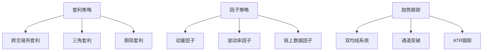
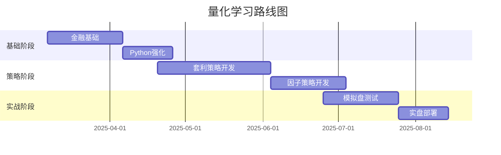

### 一、基础准备阶段（1-2个月）

**时间安排建议：**

- 工作日：19:30-21:30（扣除遛狗和晚餐时间）
    
- 周末：每天3小时（建议安排在上午）
    

**学习重点：**

1. **金融基础强化**
    
    - 《金融市场基础知识》（证券业从业资格考试教材）
        
    - 《主动投资组合管理》（Richard C. Grinold）
        
    - 重点掌握：市场微观结构、套利原理、技术分析三大假设
        
2. **编程工具专精**
    
    - 巩固Python核心库：Pandas（重点掌握resample/rolling操作）、NumPy（矢量化运算）
        
    - 回测框架：Backtrader（适合股票）和Backtesting.py（适合加密货币）
        
    - 加密市场专用库：CCXT（交易所API统一接口）
        
3. **数据源搭建**
    
    - 免费资源：Binance历史数据、Yahoo Finance
        
    - 付费推荐（性价比优先）：Cryptocompare（$29/月）
        

### 二、策略开发阶段（3-4个月）

**核心策略学习路径：**

**推荐教材：**

- 《量化交易：如何建立自己的算法交易业务》（Ernest P. Chan）
    
- 《Algorithmic Trading and DMA》（Barry Johnson）重点读第4章
    
- 《加密货币量化交易》（郑玉山，重点看套利章节）
    

**实践建议：**

1. 从简单策略开始迭代：
    
    - 首周实现双均线交叉策略（5/20周期）
        
    - 第二周加入ATR波动过滤
        
    - 第三周整合交易所费率和滑点模型
        
2. 加密货币套利专项：
    
    - 开发交易所价差监控系统（建议用CCXT）
        
    - 实现自动报警功能（当价差>1%时触发）
        

### 三、实战优化阶段（2-3个月）

**关键任务：**

1. 风险管理体系搭建
    
    - 动态头寸管理：凯利公式变体（建议风险暴露<2%）
        
    - 止损策略：三阶段止盈止损（固定比例+移动跟踪+时间衰减）
        
2. 基础设施优化
    
    - 使用Docker容器化部署策略
        
    - 搭建简易监控面板（推荐Grafana）
        
3. 性能提升技巧
    
    - 用Numba加速回测（尤其适用于高频策略）
        
    - 异步IO处理多交易所数据
        

### 四、推荐工具栈

**开发环境：**

- IDE：VS Code + Jupyter插件
    
- 版本控制：GitHub私有仓库
    
- 文档管理：Obsidian（适合策略笔记）
    

**硬件建议：**

- 基础配置：树莓派4B+（24小时运行监控）
    
- 进阶选择：AWS t3.micro实例（$3.5/月）
    

### 五、风险管理特别建议

1. 加密货币特有风险：
    
    - 交易所提币限制（建议保留20%流动性缓冲）
        
    - 闪崩防护：设置价格异常波动熔断机制
        
2. 资金分配方案：
    
    - 核心策略：60%（趋势跟踪+因子）
        
    - 套利策略：30%
        
    - 现金储备：10%
        

### 六、学习社区推荐

1. QuantConnect论坛（侧重传统市场）
    
2. Cryptotrader.org（加密货币专项）
    
3. 本地Meetup小组（建议每月参加1次）
    

### 七、阶段性目标

**注意事项：**

1. 建议先专注加密货币市场（流动性集中），逐步扩展到外汇
    
2. 每周策略复盘时间固定（建议周日晚上）
    
3. 建立策略废弃机制（连续3个月夏普比率<1自动停用）
    

这个规划充分考虑了您作为程序员的技术优势和可用时间特征，建议每完成一个阶段进行自我评估调整。保持每月开发1个可运行策略的节奏，注重质量而非数量。